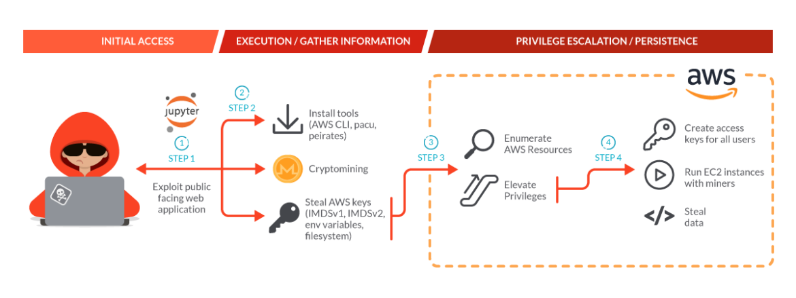
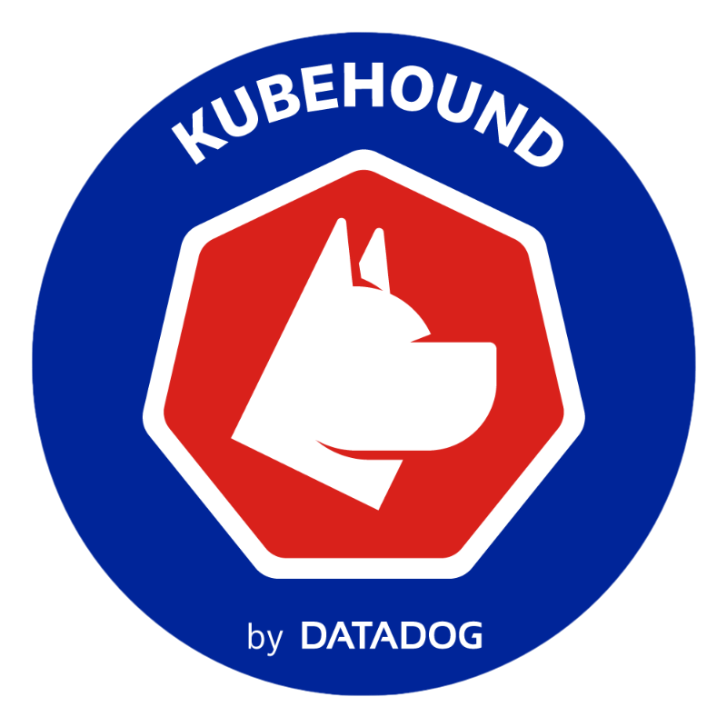
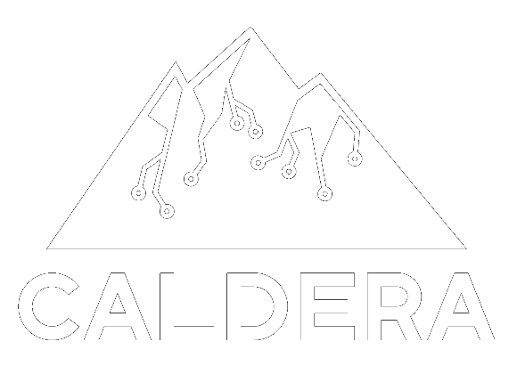

# K8s Adversary Emulation

Adopting an Attacker's Mindset for Kubernetes Security

<!-- 

  <button @click="$slidev.nav.openInEditor()" title="Open in Editor" class="slidev-icon-btn">
    <carbon:edit />
  </button>
  <a href="https://github.com/slidevjs/slidev" target="_blank" class="slidev-icon-btn">
    <carbon:logo-github />
  </a>

 -->

<!--
The last comment block of each slide will be treated as slide notes. It will be visible and editable in Presenter Mode along with the slide. [Read more in the docs](https://sli.dev/guide/syntax.html#notes)
-->

---
layout: intro
transition: fade-out
---

# Whoami

### Markus Gierlinger
<!-- <h3> Markus Gierlinger</h3> -->
 

  
   Product Manager @ Cast AI 

  
   Former security researcher @ Dynatrace 

Enjoys exploring cybersecurity and AI 

    <a href="https://github.com/Magier" target="_blank" class="slidev-icon-btn">
    <carbon:logo-github />
    Magier
  </a>
  <a href="https://www.linkedin.com/in/markus-gierlinger/" target="_blank" class="slidev-icon-btn">
    <carbon:logo-linkedin />
    Markus
  </a>

---
layout: intro
---

# Whois Molly?

- New and only **SecOps Engineer** at Wish Ltd.
  - Wish Ltd. has ~300 employees
  - Heavy use of Kubernetes
- Previously ~3 years experience as SRE
- Responsible for “securing” the product

<!-- ... instead, let met introduce you to Molly,
Molly is a newly hired SecOps Engineer at Wish Ltd.
The company has about 300 employees and is heavily using Kubernetes.
-->

---
layout: fact
---

# What does "secure" mean?

---
layout: image
image: ./assets/cncf-landscape.png
backgroundSize: contain
---

<!-- Molly is no stranger to the CNCF landscape, 
so she goes there to find tools that can help her 
... and there is certainly no shortage of tools to choose from
-->

---
transition: slide-up
---

## Defense in Depth

<v-clicks>

</v-clicks>

---

# Endless list of findings

<v-clicks>

</v-clicks>

---
layout: image
image: ./assets/overwhelmed.jpg
title: overwhelmed
---

---
layout: fact
transition: slide-up
title: secure?
---

# Does _this_ make our environments secure?

<!-- So, she's still can't confidently answer this question, so she does some more research ... -->

---
layout: fact
transition: slide-up
title: Lambert's Quote
---

"Defenders think in lists.    
Attackers think in graphs.    
As long as this is true, attackers win"  

<a href="https://github.com/JohnLaTwC/Shared/blob/master/Defenders%20think%20in%20lists.%20Attackers%20think%20in%20graphs.%20As%20long%20as%20this%20is%20true%2C%20attackers%20win.md" target="_blank" class="text-sm text-gray" >John Lambert, VP Security @ Microsoft, 2015</a>

<!-- ... until she finds this quote by John Lambert from 2015. -->

---
layout: image
image: ./assets/hacker-backside.jpg
title: hacker' mindest
---

<!-- This is makes Molly think ...
Security is all about preventing attacks, right?
So, by looking at the environment through the eyes of an attacker, she can actually answer the question!
-->

---
layout: two-cols-header
---

# Threat Intelligence

::left::

<!--  -->

<a href="https://www.wiz.io/cloud-threat-landscape" target="_blank" class="text-xs">Wiz' Cloud Threat Landscape</a>

::right::

<a href="https://https://sysdig.com/blog/scarleteel-2-0/" target="_blank" class="text-xs">Sysdig: Scarleteel 2.0</a>

<!---
Now, to be able to put herself into the shoes of an attacker, she needs to learn about them and their motivations.
So she does some more research and finds resources like Wiz' Cloud Threat Landscape, which is a database of notetworthy attacks. And a lot of other blog posts analyzing attacks

Does this this now mean Molly has to spend hours reading up on all types of attack reports?
-->

---

# MITRE ATT&CK

<arrow v-click="3" x1="125" y1="209" x2="146" y2="273" color="red" width="2" arrowSize="3" />

<arrow v-click="4" x1="125" y1="180" x2="568" y2="200" color="red" width="2" arrowSize="3" />

<arrow v-click="5" x1="568" y1="210" x2="229" y2="215" color="red" width="2" arrowSize="3" />

<arrow v-click="6" x1="229" y1="225" x2="844" y2="350" color="red" width="2" arrowSize="3" />

<a href="https://attack.mitre.org/matrices/enterprise/containers/" target="_blank" class="text-xs">MITRE ATT&CK - Containers Matrix</a>

<!--

... Thankfully no!! Mitre, the organization behind  our beloved vulnerbailit identifiers is actually constantly analyzing and cataloging all known attacks and organizes them in the so-called ATT&CK framework.

The idea is, that any attack can be broken down into several high-level phases - so-called tactics.
And at every phase of the attack attackers have a certain set of techniques they usually use.

For example, exploit a public facing app. 
And for every technique, the actual implementation of an attack is called a "procedure".

This triple of tactics, techniques and procedures is commonly called a TTP. 
What you see here, is actually a version of the ATT&CK framework specifically for containerized environments.

What Molly can do now, is use this and try to play out scenarios. For example: once an attacker has access to a container, they can execute commands as a user ... or in K8s, read the SA token mounted inside the pod.
If the token has the permissions, the attacker can create a new pod, which may containe a cryptominer. So the final goal would be to mine crypto currency at the customers dime.

This chain of steps of TTPs is called an attack path ...
-->

---

# Attack Graph

= combination of TTPs

#### Resource-centric

 

  
#### Attack-centric
 

<!--

... an attack graph!

For completeness: there are actually 2 flavors of graphs:
- a resource-centric one that focuses on the resources, and the attacker steps are the edges in-between
- or a attack-centric one, which focuses on the TTPs and the edges often have not much meaning

The preferred one usually depends on the use case. For example, Molly, as a defender would care more about the resource-centric graph
-->

---
layout: image-right
image: ./assets/abstract-apa.jpg
backgroundSize: contain
---

# Attack Path Analysis 

<v-clicks class="text-2xl mt-20 space-y-4">

- _Models_ all possible attack paths
- Full visiblity of environment
- Contextualizes findings
- Enables advanced analysis

</v-clicks>

---
layout: two-cols
---
# Attack Path Analysis Tools

  <a href="https://github.com/ReversecLabs/IceKube" class="text-m">IceKube</a>
  

<v-clicks >

- 25 TTPs 
- uses Neo4J 
- Query using Cypher

</v-clicks>

::right::

<v-clicks class="">

  <a href="https://kubehound.io/">KubeHound</a>
  

  - 25 TTPs 
  - uses JanusGraph 
  - Jupyter Notebook for analysis
  - experimental automation features 

</v-clicks>

--- 
class: px-10
layout: two-cols-header
---

# Getting real

<!-- 
 -->
::left::

  <!-- Attack Path Analysis -->

# Attack Path Analysis 
<!-- - Models attack -->
<!-- - Full visiblity -->

::right::

<v-click>

# Adversary Emulation

<!-- - Performs attack
- limited visibility -->

</v-click>

::bottom::

 
 
 

---
transition: slide-up
---

# Adversary Emulation

- Perform attack on real environments

- Evalates the effectiveness of security controls

- Varying degree of realism:

---
level: 2
---

# Atomic Emulation

- detonate single TTPs
- primarily use-case:
  - test processing pipeline
  - manage detections  

#### Tools

  

  

    <a href="https://github.com/redcanaryco/atomic-red-team">Atomic Red Team</a>
    
  

  - [1700+ TTPs](https://www.atomicredteam.io/atomic-red-team)
  - focus on OS-based TTPs
  - ~10 TTPs for Docker + K8s 

  

  

  

    <a href="https://github.com/DataDog/stratus-red-team">Stratus Red Team</a>
    
  

  - [50+](https://www.atomicredteam.io/atomic-red-team) 
  - focuses on AWS, Azure, GCP
  - ~8 TTPs for K8s 
  

<!-- e.g. is everything working properly, after installing a detection tool? -->

---
layout: image
---

---

# Planned Emulation

<!-- 
 -->

- aka "[Micro emulations](https://ctid.mitre.org/projects/micro-emulation-plans/)"

<v-clicks >

- easy to automate
- Validate atomic + chain analytics
- good for reproducing scenarios

</v-clicks>

---

# Planned Emulation: Tools

<h3> <a href="https://github.com/mitre/caldera">Mitre Caldera</a> </h3>
  

<v-clicks class="mt-2">

- oldest and most mature emulation tool (2015)
- primary for enterprise environments
- no special K8s support
- big plugin ecosystem
- supports automated planning

</v-clicks>

<h3 v-click>
<a href="https://github.com/ReversecLabs/leonidas">Leonidas</a>
</h3>

<v-clicks class="mt-10">

- similar to Stratus Red Team
- allows chaining of TTPs
- runs as workload inside K8s cluster
- supports only `kubectl`-based TTPs for K8s

</v-clicks>

---

# Realistic Emulation

<v-clicks>

- "Fog of War"

- a red team engagement

</v-clicks>

<v-clicks class="mt-20">

<h4 class="mt-15 mb-2">Use Cases</h4>

- Evaluate incident response plans
- testing more sophisticated defenses
    - Moving Target Defense
    - Deception
</v-clicks>

## Tools

 
 

<v-click at="8">

<a  href="https://github.com/magier/ran">Ran</a>
</v-click>

---
layout: fact
---

# Demo

--- 

# Take-aways

   Adopt an attacker's mindset to assess your effective security.

  <h3 class="mb-2">Attack Path Analysis</h3>

  - Contextualize security findings
  - Uncover dangerous combinations
  - Plan for improvements

  

  

    <h3 class="mb-2">Adversary Emulation</h3>

  - Validate security controls
  - Improve detection & response
  - Show value of more advanced defenses

  

  

